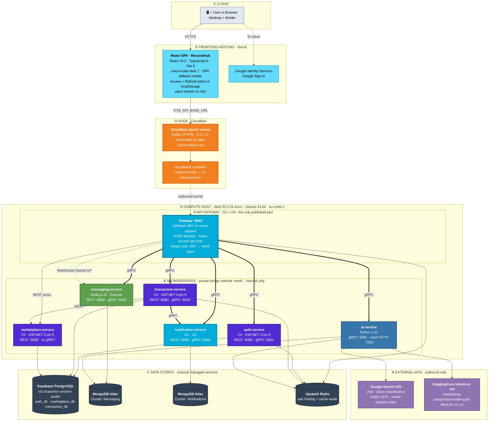
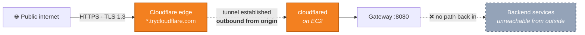
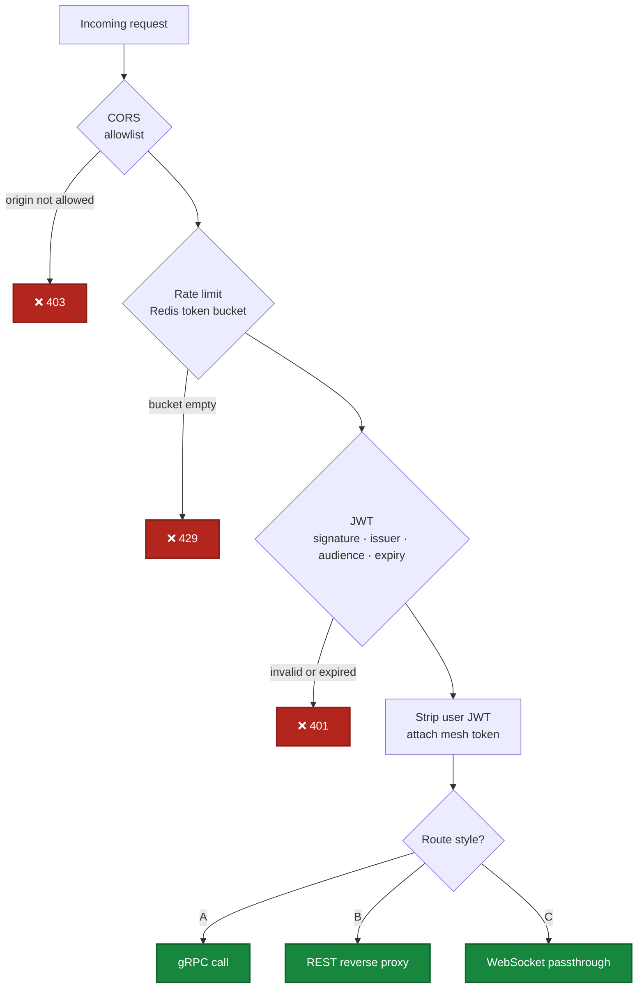
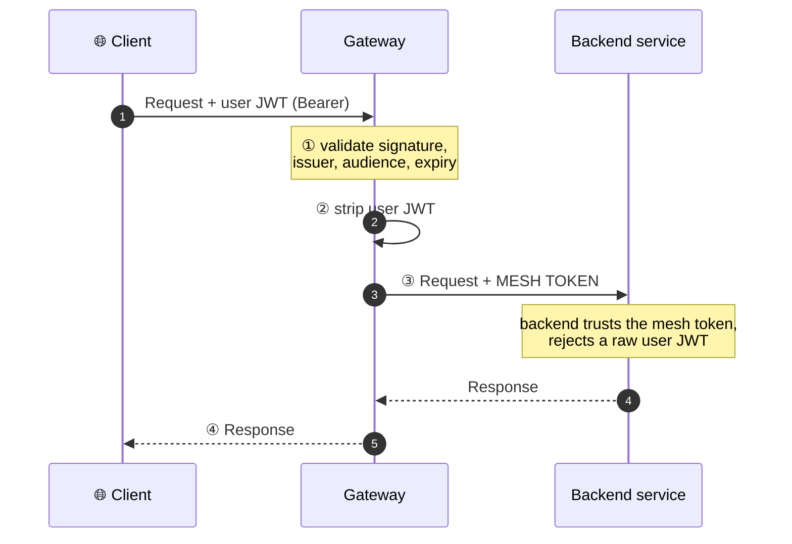
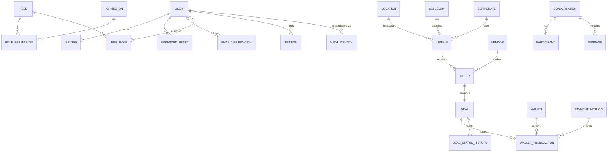
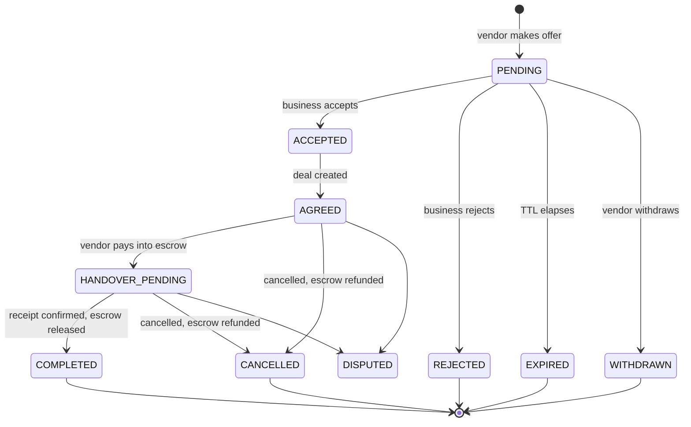
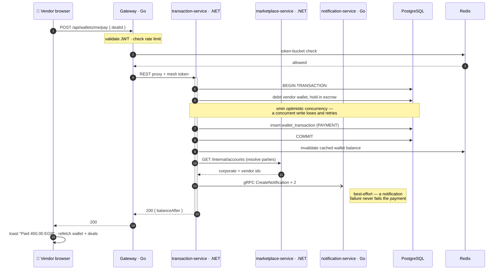
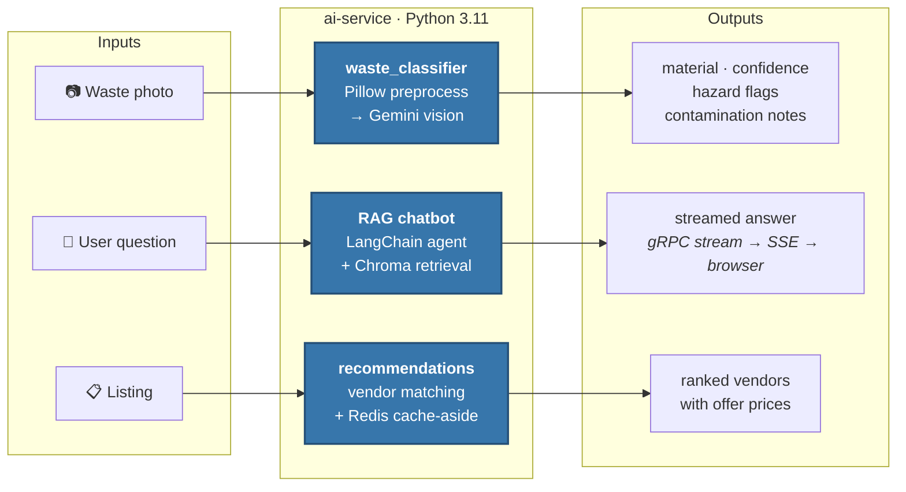
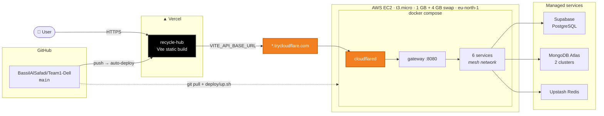

<div align="center">

# ♻️ RecycleHub

### Circular Economy Marketplace

**A polyglot microservices marketplace that turns industrial and commercial waste into traded value.**
Businesses list the waste they produce; vendors discover it, bid on it, collect it, and pay for it
through an escrow-backed wallet — with an AI layer that classifies waste from a photo, answers
questions from a RAG knowledge base, and recommends who to sell to.

<br/>

[](https://react.dev)
[](https://www.typescriptlang.org)
[](https://vite.dev)
[](https://dotnet.microsoft.com)
[](https://go.dev)

[](https://nodejs.org)
[](https://www.python.org)
[![gRPC](https://img.shields.io/badge/gRPC_%C2%B7_proto3-244C5A?style=for-the-badge&logo=data:image/png;base64,iVBORw0KGgoAAAANSUhEUgAAACAAAAAgCAYAAABzenr0AAAEsUlEQVR42u1WW2xUVRRd+9zpDJTSIraF0mLTmduhGR7G4BOMUxWxdKY0flzLzLSKok1EPsT4AUi8ufBh4peQ+AiJb2gxAwpKa0NJ5EbjA20MJgyknWKqFpBIi9Jpy8ycs/3olJTy/NAfM+vnnNx9ztn7rL33OhfIIosssgBgmqYAQGCmK4xX+/YvwmEyC4tIAQCIANMUsCzOhEYgUsxMRMR+v98xvtEuLmZEowoAA8D1bJlbCv/hw+LSmupqBcsa87sqfuKhRXv3HSp8NFJyBTvMzsz0WkzcmCHD0K61l17oOVHf/eV378aOHp/5x4KKY/ndJ5++NX5qIKWUGr5nYV3VnNJnFz9yX8Nr5ZXHvMHIMwooBBET6MzUUd7zc+fOxOLm5pzB/kRYEErApEjDr3P+8uyxbSsNw9AQjUpvMFSloDURYTZAFyC5tad95/eCpbo9eSExM3nunCJNq8JF5WOp5kBDmRxNLpSjF+eTQlGRz5enAAtMipVKg7As4ZRfu5cZBSODgy7BvIUIglkpMDX0T+vuLAk25yIalZW14dUMsQfAn8z8MTH3sIb39WCoDgBQ8+ORl8refmcgf8PLyydz1MDDcwGgLPBEqac2fGiiTa8Nd3hqw00A4AmE7MttoS53MHS/t86o0AOhU57lDXMn2svr62d4g6HCsconYpw8Vg73/D49GNkghFikpBrgtDyYSgw7n3r4jk92//Tb7HR6dHdve8sDAOB+rLGYkvIwmJ4vS/R/1Z9Xajt/ST0Yi0WT7mDTbaTS35AS97KmXgTTUG97yyvlfv+UvurqpBGLUTQalZcKyG+aDtuy0nogvB2EMk3QRlbIV4q3QYDjB1qW6jVGEYucI0R0lMG5QhNOJdW3vW0tG/WaSD6E6iISx5k4TSTmspKfxdtat3oC4U6SvD3e4W2DESNkHI/7dgAg27LSFXVrZkEOL43npu8eX1RZ27hesdwMAFpay5FOHoCkTaRhvUpL0dveuhEApVxDIic1bUAosUW5kEgO/n26z95/fkxbMAKi6TBihLNnaUJbEizgUl9qqdEcJkplnBMASJIDxJQCAOVyEhOG4h27YqVD/c8BtMS9YtWdANglcx0EjJz44sOunn0fHe+z95/Xa2pcYzqgOiG4CdGohG2rTEvSmAZYSgBgmKaId+z6ncBn9EBkKwxDuA2jgECvApwPACwlAeQqCTbn2radFqAtQoi3AJAYcTADU6tWrskDTAFAxDs6kjBNQer8DmbMyJw7ngL2BBrXeQKhTTQxH77lxi1Jl/N1EE2D5BQznwZxYW9ba1N57ZOzHUi+WZbwPm5XQ8GylB4I7WOm93rvqvxc/6H70wIxPdR1YMdw5jweH93LjAJtivMNJppFjDMAZjCzVEhtvqo8FRlr8wCgYkWD1xMI7cWY1jp8huGcrIA+w8gDgAzl11VKvSZSNq9+9ZJ5KyPzJr9GAgD0QGhbZV3juoq6VbP0lRGfJxCy9UAoMqam15TTmwFdIcemKQCmy1LgXhFeoDnEWmYUEIGlSh882bb7g8mUXuemfMNAMtUPZB6im4r+P8QkWk3h90Pr6+tjmKZAcbFALKayf0xZZPG/xj+jqhKIAGfFIAAAAABJRU5ErkJggg==)](https://grpc.io)
[](https://www.docker.com)
[](https://www.postgresql.org)

[](https://www.mongodb.com/atlas)
[](https://upstash.com)
[](https://supabase.com)
[](https://ai.google.dev)
[](https://www.langchain.com)

[](https://vercel.com)
[![AWS](https://img.shields.io/badge/AWS_EC2-FF9900?style=for-the-badge&logo=data:image/png;base64,iVBORw0KGgoAAAANSUhEUgAAACAAAAAgCAYAAABzenr0AAAACXBIWXMAAC4jAAAuIwF4pT92AAACtUlEQVRYw+2WSUiVURTHn31a9rTMIsuMIiwqsIWFgbUoSlNatGuyIJugTUojuokiRIuKBgiMZi1oooJWRRAUmVQgDWLDKoNMMiqyWT//f/w/ON1e8opc9R348b57zh3OPfeec18oFEgggUh8348H+WAd2A5WgVHGPhNkO2MyQB4Y4uingOmmPQlsBlWgBIxzF08AL/1u+Qw+6Zu/s9TniWxhM+6M+u0xuhTwDdSpvQl0gC+gWXPQnu46UA6yjG6eBt5Ue7cWyzN9XoEf4J4zztd8IyNzgCTZ+4JCu5GejuUheKvvGZq4Qu2xap8C38EA6fdKP1Ghp1wAcbEsmAOWg5VgNrgDOs0daQO31S5WWLO1SL70D0CTvj3QIPt9sBqkRVuYR3BJHbnIM/36EQfUr0bnlwwOg1vcGXgNtnFy9gc7zJhh4Ki5V1/BQR6FdaBERobPM/objgML1I9n2AQqpWeIr4OFsudG2WQYzFeEKBus8biU05y0fCF9onQDtYNj2ulc6UvBR3BEF7NPD8c8XnPWWuVWKQ/wtjJPwUkt4jp2VcfA2z1IuskmhaudelDG7FIE0sF+9S21DgwGjf7PwrAu0kJFpu8a2e8anWfuzBzHgXfOvJ2KuOeGph8Hg6VMH6Mf7vTjYmMiuzf6oWC0m248PmXUCrCYR/DfvjWesmcLOAT2MatoOKsHKNzLDnDBK6oJ58EHQkN/cBq0gI18THrRiTiVZ09vyyNrLNaNZSpd1IVJ+kcLT1ClfA6e6sW8DHa5HUeomHQoZdpV4XaqCmbGsFgqmKpbf8IUM5biSkWcBe39b+eTx9Wmfluhc2+0k3pwjc+xSnNrlP78D1DBPy9OtMtjCR09XQLO6Y7EInTwsR6rgl8KTve8aX97lpms/2Ct0qlKu1sPlukvXUookEAC+QPpAnZ4z5k7eGmwAAAAAElFTkSuQmCC)](https://aws.amazon.com/ec2/)
[](https://www.cloudflare.com)
[](https://socket.io)
[](https://huggingface.co)

</div>

---

## Table of contents

**Overview**
- [What this is](#what-this-is)
- [The full architecture](#the-full-architecture)
- [Transport legend](#transport-legend)

**The eight layers**
- [1 · Client](#1--client)
- [2 · Frontend hosting — Vercel](#2--frontend-hosting--vercel)
- [3 · Edge — Cloudflare](#3--edge--cloudflare)
- [4 · Compute host — AWS EC2](#4--compute-host--aws-ec2)
- [5 · The API gateway](#5--the-api-gateway)
- [6 · The six microservices](#6--the-six-microservices)
- [7 · Data stores](#7--data-stores)
- [8 · External APIs](#8--external-apis)

**Deep dives**
- [Security model](#security-model)
- [Data model](#data-model)
- [Request flows](#request-flows)
- [The AI service](#the-ai-service)

**Working with the repo**
- [Tools & technologies](#tools--technologies)
- [Repository layout](#repository-layout)
- [Running it locally](#running-it-locally)
- [Configuration](#configuration)
- [Deployment](#deployment)
- [Project stats](#project-stats)

---

## What this is

A **circular economy marketplace**: a two-sided platform connecting waste-producing businesses
with recycling vendors.

| Role | What they do |
|---|---|
| 🏢 **Business** (corporate) | Lists waste — type, quantity, condition — receives offers from vendors, accepts one, hands over the material, gets paid. |
| 🚚 **Vendor** | Browses open requests, makes priced offers, pays into escrow, collects the material, confirms receipt. |

The full lifecycle — **listing → offer → accept → deal → escrow payment → handover → completion →
payout** — is implemented end to end, with an in-app wallet that moves real balances between the two
parties at each stage, guarded by optimistic concurrency so two simultaneous writes can never
corrupt a balance.

### Live

| | |
|---|---|
| **Frontend** | [recycle-hub-drab.vercel.app](https://recycle-hub-drab.vercel.app) — auto-deploys from `main` |
| **Backend** | AWS EC2 `t3.micro` (eu-north-1), exposed via a Cloudflare Quick Tunnel — [URL is ephemeral](#deployment) |
| **Cost** | **$0/month** — every tier is a free tier |

---

## The full architecture

Eight layers, from the browser down to the managed databases. **Seven processes** run on a single
EC2 instance: one gateway plus six services, written in **five languages**, speaking **gRPC**
internally and **REST/WebSocket** externally.



---

## Transport legend

Three transports move data through the system, and which one is used is a deliberate choice at
every hop:

| Transport | Protocol | Where it's used | Auth carried |
|---|---|---|---|
| **gRPC** | HTTP/2 · proto3 | Gateway → backends for typed RPCs; service → service inside the mesh | **Mesh token** (internal) |
| **REST** | HTTP/1.1 · JSON | Browser → gateway; gateway → backends as reverse-proxy fallback | User **JWT** at the edge, mesh token behind it |
| **WebSocket** | Socket.IO | Browser → gateway → messaging-service for realtime chat | Socket.IO's own handshake auth |
| **Cloudflare Tunnel** | outbound QUIC/HTTP2 | EC2 → Cloudflare edge — **never inbound** | n/a |

---

## 1 · Client

A single-page application in the browser, on desktop and mobile. There is no native app; the
frontend is fully responsive down to 375 px, with a dedicated mobile navigation drawer below
900 px.

Everything the client talks to goes through **one origin** — the Cloudflare tunnel hostname
configured as `VITE_API_BASE_URL` at build time.

---

## 2 · Frontend hosting — Vercel

| | |
|---|---|
| **Framework** | React 19.2 · TypeScript 6 · Vite 8 |
| **Routing** | `react-router-dom` 7, client-side, 13 routes across two role variants |
| **Deploy** | Automatic on every push to `main` |
| **SPA fallback** | `vercel.json` rewrites `/(.*)` → `/index.html` so deep links and hard refreshes don't 404 |
| **Styling** | Hand-written CSS with a token-based design system in `index.css` — no UI framework |
| **State** | React Context (`lib/auth.tsx`) — no external state library |
| **HTTP** | Native `fetch`, wrapped in `lib/api.ts` — no HTTP client library |

### Session handling

Access and refresh tokens live in `localStorage`. `lib/api.ts` implements a **silent refresh**:
a 401 triggers a token refresh and one automatic retry of the original request. Concurrent 401s
share a single in-flight refresh promise, so ten parallel requests hitting an expired token
produce **one** refresh call, not ten.

`Google Identity Services` provides Google Sign-In; the returned ID token is posted to
auth-service, which verifies it and issues the app's own JWT pair.

---

## 3 · Edge — Cloudflare

The `cloudflared` container establishes a **Quick Tunnel** — an outbound-only connection from the
EC2 box to Cloudflare's edge.



**Why this matters:** the tunnel is what lets the whole backend run with **zero inbound ports
open** on EC2. TLS terminates at Cloudflare's edge; the origin never needs a certificate, a public
IP with open ports, or a reverse proxy of its own. The tunnel proxies to the **gateway only** —
no backend service is reachable from the internet at any point.

> [!IMPORTANT]
> A Quick Tunnel gets a **new random hostname** every time the `cloudflared` container restarts.
> When that happens, `VITE_API_BASE_URL` must be updated in Vercel and the frontend redeployed —
> otherwise the UI renders perfectly while every API call fails. See [Deployment](#deployment) for
> the permanent-hostname upgrade path.

---

## 4 · Compute host — AWS EC2

| Spec | Value |
|---|---|
| **Instance** | `t3.micro` — 1 GB RAM + 4 GB swap |
| **OS** | Ubuntu 24.04 LTS |
| **Storage** | 30 GB gp3 EBS |
| **Region** | `eu-north-1` (Stockholm) |
| **Runtime** | Docker Engine + Docker Compose |
| **Network** | All containers on one private bridge network, `mesh` |
| **Security group** | Inbound **SSH (22) only** — nothing else |
| **Billing guard** | AWS Budgets zero-spend alert |

### Fitting eight containers into 1 GB

Six services + gateway + `cloudflared` on a 1 GB box is tight, and three of those services are
.NET. Two things make it work:

1. **A 4 GB swapfile is mandatory** — without it the .NET builds get OOM-killed mid-restore.
2. **Builds run serially** (`COMPOSE_PARALLEL_LIMIT=1`, baked into `deploy/up.sh`) — parallel
   NuGet restores saturate the box and start dropping connections.

The ai-service runs for real rather than as a placeholder because embeddings are computed through
the **HuggingFace Inference API** over HTTP instead of a local `torch` install — which would not
fit in this footprint.

The trade-off is a slow cold start: the first request to each .NET service takes roughly 10 s.

### Port exposure

```
EC2 :8080  ──published──▶  gateway :8080          ← the ONLY published port
                            │
                            ├── auth-service        expose: 8080, 6001   (mesh only)
                            ├── transaction-service expose: 8080, 6002   (mesh only)
                            ├── marketplace-service expose: 8080         (mesh only)
                            ├── messaging-service   expose: 8080, 6003   (mesh only)
                            ├── notification-service expose: 8080, 6004  (mesh only)
                            └── ai-service          expose: 6005, 7005   (mesh only)
```

`docker-compose.yml` uses `expose:` (network-internal) rather than `ports:` (host-published) for
all six services. Docker's internal DNS resolves them by service name — `auth-service:6001`,
`transaction-service:8080` and so on.

---

## 5 · The API gateway

Written in **Go** with the **chi** router. It is the single public entry point and the only place
end-user authentication exists.

### What it does on every request



### Three routing styles

The gateway mixes three transports behind one origin. chi's radix-tree routing prefers a **literal
route** over a **wildcard mount**, so a specific gRPC route and a catch-all REST proxy can be
registered on the same prefix and the specific one wins.

| | Style | Used for | Example |
|---|---|---|---|
| **A** | **gRPC** call to a backend | Typed RPCs that already exist in `proto/` | `GET /api/deals/{dealId}` → `TransactionService.GetDeal` |
| **B** | **REST** reverse-proxy passthrough | Everything else — the fallback | `POST /api/listings` → `marketplace-service:8080` |
| **C** | **WebSocket** passthrough | Realtime chat | `/socket.io/*` → `messaging-service` |

### Two routing subtleties worth knowing

Both of these were real bugs, and both are documented in the router source:

- **`/api/deals/mine` must be registered as its own literal route.** chi prefers a named
  parameter (`{dealId}`) over a wildcard at the same segment, so without an explicit literal
  route, `GET /api/deals/mine` matched `{dealId}="mine"` and hit the single-deal gRPC lookup with
  `"mine"` where a GUID was expected.
- **Bare paths need their own entry alongside their wildcard.** chi's `/*` only matches a path
  *with* a trailing segment, so `GET /api/wallets` needs a separate registration from
  `/api/wallets/*`.

### Why `RealIP` middleware is deliberately not used

chi ships a `RealIP` middleware that rewrites `RemoteAddr` from the client-supplied
`X-Forwarded-For` header. Using it would hand the rate limiter a **spoofable key** — any client
could bypass rate limiting by sending a random `X-Forwarded-For` on each request. Instead the
rate-limit middleware consults `X-Forwarded-For` itself, but only when the immediate peer is a
configured `TRUSTED_PROXIES` entry.

---

## 6 · The six microservices

All six run on the private `mesh` network and are unreachable from the internet.

<table>
<tr>
<th width="16%">Service</th><th width="14%">Stack</th><th width="42%">Responsibilities</th><th width="14%">Ports</th><th width="14%">Datastore</th>
</tr>

<tr><td>

**auth-service**


</td><td>

ASP.NET Core 9<br/>EF Core<br/>Clean Architecture

</td><td>

- Registration & login
- **Argon2id** password hashing — 4 lanes / 64 MB / 3 passes
- JWT issuance (access + refresh)
- Google Sign-In — ID token verification
- Email verification codes
- Password reset
- Roles & permissions
- Vendor reviews & ratings

</td><td>

REST `:8080`<br/>gRPC `:6001`

</td><td>

Postgres<br/>`auth_db`

</td></tr>

<tr><td>

**transaction-service**


</td><td>

ASP.NET Core 9<br/>EF Core<br/>Clean Architecture

</td><td>

- Wallets, top-ups, withdrawals
- Offers, deals, payment methods
- **Escrow** — hold, release, refund
- **Optimistic concurrency** via Postgres `xmin`
- Retry on lost updates
- Redis cache-aside on wallet balance, with write-invalidation

</td><td>

REST `:8080`<br/>gRPC `:6002`

</td><td>

Postgres<br/>`transaction_db`

</td></tr>

<tr><td>

**marketplace-service**


</td><td>

ASP.NET Core 9<br/>EF Core<br/>Clean Architecture

</td><td>

- Waste listings + search/filter
- Vendor profiles
- Corporate profiles
- Categories
- Locations
- **REST-only** — no gRPC server

</td><td>

REST `:8080`

</td><td>

Postgres<br/>`marketplace_db`

</td></tr>

<tr><td>

**messaging-service**


</td><td>

Express<br/>Mongoose<br/>Socket.IO

</td><td>

- Conversations, messages, participants
- **Realtime chat** over WebSocket
- `@grpc/grpc-js` + `@grpc/proto-loader` — proto loaded at *runtime*, not code-generated

</td><td>

REST `:8080`<br/>gRPC `:6003`

</td><td>

MongoDB Atlas<br/>*Messaging* cluster

</td></tr>

<tr><td>

**notification-service**


</td><td>

chi<br/>`mongo-driver` v2<br/>`google.golang.org/grpc`

</td><td>

- Per-recipient notification feed
- Unread counts
- Read state & receipts
- Other services publish into it over gRPC (`CreateNotification`)

</td><td>

REST `:8080`<br/>gRPC `:6004`

</td><td>

MongoDB Atlas<br/>*Notifications* cluster

</td></tr>

<tr><td>

**ai-service**


</td><td>

LangChain<br/>Chroma<br/>grpcio

</td><td>

- RAG chatbot — LangChain + Chroma
- Waste image classifier — Gemini vision
- Waste recommendations
- Vendor search, Redis cache-aside
- **gRPC server only — no REST API**
- Mesh-status HTTP endpoint on stdlib

</td><td>

gRPC `:6005`<br/>HTTP `:7005`

</td><td>

MongoDB Atlas<br/>chat threads

</td></tr>

</table>

### Clean Architecture in the .NET services

Each of the three C# services splits into the same three projects:

```
ServiceName.Api             ← controllers, contracts, middleware, gRPC servers
ServiceName.Domain          ← entities, pure domain logic, zero dependencies
ServiceName.Infrastructure  ← EF Core persistence, options, external adapters
```

### The shared gRPC contract

[`proto/`](proto/) holds **six `.proto` files** — `auth`, `transaction`, `messaging`,
`notification`, `ai`, `health` — defining **12 RPCs** (10 domain + 2 health). One source of truth,
consumed three different ways:

| Language | How stubs are produced |
|---|---|
| **C#** | `Grpc.Tools` generates at **build time** from `<Protobuf Include=...>` in the `.csproj` |
| **Node.js** | `@grpc/proto-loader` loads the `.proto` at **runtime** — no codegen step |
| **Go / Python** | Generated stubs are **checked into the repo** |

The mesh is **full-mesh**: every service holds client stubs for every peer, not just the ones it
currently calls.

---

## 7 · Data stores

All three are **external managed services** — there are no database containers in the compose file.

### Supabase PostgreSQL — three schemas

```
Supavisor session-mode pooler
        │
        ├── auth_db          ← auth-service
        ├── marketplace_db   ← marketplace-service
        └── transaction_db   ← transaction-service
```

> [!WARNING]
> The connection string **must** use the Supavisor **session-mode pooler** host, not
> `db.<ref>.supabase.co`. The direct host is **IPv6-only**, and most dev machines, CI runners and
> the EC2 box itself have no IPv6 route — it fails with a confusing connection timeout.

### MongoDB Atlas — two separate clusters

| Cluster | Owner | Collections |
|---|---|---|
| **Messaging** | messaging-service | `conversations`, `messages`, `participants` |
| **Notifications** | notification-service | `notifications`, unread counts, read state |

### Upstash Redis — one shared instance, two jobs

| Consumer | Use |
|---|---|
| **Gateway** | Token-bucket rate limiting |
| **auth-service** | Email verification codes — SHA-256 hashed, 15-minute TTL |
| **transaction-service** | Cache-aside on wallet balance, invalidated on write |
| **ai-service** | Cache-aside on vendor search results |

Connections use `rediss://` (TLS).

### Database-per-service, enforced

The governing rule from [`Artifacts/circular-economy-marketplace-eerds.pdf`](Artifacts/):

> **Database-per-service. No cross-database foreign keys. Cross-service references are plain
> external IDs, resolved through the owning service's API at read time — never joined.**

This is why a notification carries `entity: { type, id }` rather than a foreign key, and why
transaction-service calls marketplace-service over REST to resolve a listing rather than joining
to it.

---

## 8 · External APIs

Outbound calls only — nothing external can reach in.

| API | Used for |
|---|---|
| **Google Gemini** | Chat completions · vision-based waste classification · Arabic OCR for PDF ingestion · model + key fallback chain |
| **HuggingFace Inference API** | Embeddings — `sentence-transformers/paraphrase-multilingual-MiniLM-L12-v2`. Used over HTTP specifically so no local `torch` is needed. |
| **Google Identity Services** | Google Sign-In ID token issuance (called from the browser, verified by auth-service) |

---

## Security model

### The JWT → mesh token swap

The single most important property of this architecture: **backend services never see a user
JWT.** They accept only the internal mesh token.



**Why:** a published backend port would route around authentication entirely if backends accepted
user JWTs — an attacker who reached one directly could act as any user. Because backends accept
only the mesh token, and the mesh token never leaves the private network, there is no such path.

### Controls

| Control | Implementation |
|---|---|
| **Password hashing** | Argon2id via `Konscious.Security.Cryptography` — 4 lanes, 64 MB, 3 iterations |
| **Timing-attack resistance** | A failed lookup still runs one full Argon2id verification, so "user not found" and "wrong password" take the same time |
| **Authentication** | JWT access + refresh; silent refresh on 401 with a single shared in-flight refresh |
| **Email verification** | 6-digit codes, 15-min TTL, stored in Redis as **SHA-256 hashes** — never plaintext |
| **Federated login** | Google Sign-In with server-side ID-token verification |
| **Authorization** | Role/permission tables (`VENDOR`, `CORPORATE`); ownership enforced server-side |
| **Mesh isolation** | Backends accept only `INTERNAL_SERVICE_TOKEN`, never a user JWT |
| **Rate limiting** | Redis token bucket (RPS + burst), keyed on real client IP |
| **IP spoofing** | `X-Forwarded-For` trusted **only** from configured `TRUSTED_PROXIES` |
| **CORS** | Explicit allowlist, **required at startup** — no wildcard fallback, so a misconfigured deploy fails loudly instead of silently allowing every origin |
| **Ownership scoping** | `/api/deals/mine` and `/api/offers/mine` replaced earlier `party/{id}` routes that let any authenticated user enumerate another user's records |
| **Network** | Zero inbound ports on EC2; SSH 22 restricted; only gateway `:8080` published to the tunnel |

Full review: [`SECURITY_AUDIT.md`](SECURITY_AUDIT.md).

---

## Data model



| Database | Engine | Owner | Tables / collections |
|---|---|---|---|
| **auth_db** | PostgreSQL | auth-service | `users` · `auth_identity` · `session` · `role` · `permission` · `role_permission` · `user_role` · `email_verification` · `password_reset` · `review` |
| **marketplace_db** | PostgreSQL | marketplace-service | `vendor` · `corporate` · `listing` · `category` · `location` |
| **transaction_db** | PostgreSQL | transaction-service | `wallet` · `wallet_transaction` · `payment_method` · `offer` · `deal` · `deal_status_history` |
| **Messaging** | MongoDB | messaging-service | `conversations` · `conversation_participants` · `messages` |
| **Notifications** | MongoDB | notification-service | `notifications` — polymorphic `entity: {type, id}` target |

SQL migrations live under each service's `db/migrations/`.

---

## Request flows

### The deal state machine



### Paying for a deal — the most cross-cutting operation



**Escrow is atomic with the status transition.** `WalletService.ReleaseEscrowAsync` and
`RefundEscrowAsync` join the *same* EF Core database transaction as the deal update rather than
opening their own — so a deal can never reach `COMPLETED` without its payout landing, and can
never be `CANCELLED` without the refund.

---

## The AI service

The only Python service, and the only one with **no REST API at all** — every route is gRPC,
proxied by the gateway under `/api/ai/*`.



| Capability | Detail |
|---|---|
| **Streaming chat** | `ChatStream` is a *server-streaming* RPC. The gateway converts the gRPC stream to Server-Sent Events, so replies render token-by-token in the browser. |
| **Key & model fallback** | `gemini_keys.py` rotates a primary and fallback API key. A mid-stream model fallback emits a `reset` event so the client discards the partial reply and starts over cleanly. |
| **Embeddings over HTTP** | HuggingFace Inference API instead of local `torch` — the reason the service fits on a 1 GB box. |
| **Arabic OCR** | One RAG source PDF is Arabic and produces mojibake under normal text extraction, so ingestion runs **per-page Gemini vision OCR**, cached to `data/ocr_cache/`. |

> [!NOTE]
> **RAG ingestion is a manual prerequisite.** `chatbot/chat.py` exits with an error if
> `data/vector_store/` is empty. Place the source PDFs in `data/source_pdfs/` (gitignored) and run
> `python -m chatbot.ingest` first. The first run is slow and costs API calls because of the OCR pass.

> [!WARNING]
> **Guardrails are prompt-only.** Despite a commit titled "Adding Guardrails", the sole safety
> mechanism is one instruction inside `SYSTEM_PROMPT` in `chatbot/agent.py` telling the model to
> refuse illegal or unsafe requests. There is **no moderation API and no code-level filter**.

---

## Tools & technologies

<table>
<tr><td valign="top" width="33%">

### Frontend
<br/>
<br/>
<br/>
<br/>
<br/>


</td><td valign="top" width="33%">

### Backend languages
<br/>
<br/>
<br/>


</td><td valign="top" width="33%">

### Backend frameworks
<br/>
<br/>
<br/>
<br/>


</td></tr>

<tr><td valign="top">

### Databases
<br/>
<br/>
<br/>
<br/>


</td><td valign="top">

### DevOps & infrastructure
<br/>
<br/>
<br/>
<br/>
<br/>
<br/>


</td><td valign="top">

### AI / ML & data
<br/>
<br/>
<br/>
<br/>


</td></tr>

<tr><td valign="top">

### Authentication & security
<br/>
<br/>
<br/>
<br/>


</td><td valign="top">

### API & communication
<br/>
<br/>
<br/>
<br/>


</td><td valign="top">

### Development tools
<br/>
<br/>
<br/>
<br/>
<br/>


</td></tr>
</table>

### Observability

There is no dedicated APM or metrics stack. Monitoring is whatever each managed platform provides:

| Source | What it gives you |
|---|---|
| **Docker logs** | `~/dc logs -f <service>` on the VM — the primary debugging tool |
| **Cloudflare** | Edge request analytics |
| **Upstash** | Redis command metrics and throughput |
| **MongoDB Atlas** | Cluster monitoring, slow-query log |
| **Supabase** | Postgres logs and query performance |
| **Vercel** | Frontend build + deployment logs |

---

## Repository layout

```
Team1-Dell/
├── Frontend/Recyclehub/          # React 19 + TypeScript + Vite SPA
│   ├── src/pages/                #   13 routed pages (business + vendor variants)
│   ├── src/components/           #   Navbar, modals, toasts, chatbot widget
│   └── src/lib/                  #   api client, auth context, toast bus, useModal
│
├── gateway/                      # Go — the single public entry point
│   ├── cmd/server/               #   main
│   └── internal/                 #   router, handlers, middleware, proxy, ratelimit
│
├── services/
│   ├── auth-service/             # C# / ASP.NET Core 9 · Clean Architecture · Postgres
│   ├── marketplace-service/      # C# / ASP.NET Core 9 · Clean Architecture · Postgres
│   ├── transaction-service/      # C# / ASP.NET Core 9 · Clean Architecture · Postgres
│   ├── messaging-service/        # Node 20 · Express + Mongoose + Socket.IO · Mongo
│   ├── notification-service/     # Go · chi + mongo-driver v2 · Mongo
│   └── ai-service/               # Python 3.11 · LangChain + Gemini + Chroma
│
├── proto/                        # Shared gRPC contracts — single source of truth
│   ├── auth/v1/  transaction/v1/  messaging/v1/
│   └── notification/v1/  ai/v1/  health/v1/
│
├── deploy/                       # VM bootstrap, compose launcher, demo seed script
├── infra/cloudflare-tunnel/      # Per-service tunnel configs (future multi-host setup)
├── Artifacts/                    # System-wide EERD design document (PDF)
│
├── docker-compose.yml            # Dev mesh — gateway published, services internal only
├── docker-compose.prod.yml       # Prod overlay — adds cloudflared, restart policies
├── Dockerfile                    # Single-container build (all 7 processes + supervisord)
└── run-services.sh               # Bare-metal launcher, no Docker
```

### Supporting documents

| Document | Contents |
|---|---|
| [`CLAUDE.md`](CLAUDE.md) | Repo conventions, gotchas, per-service build commands |
| [`SECURITY_AUDIT.md`](SECURITY_AUDIT.md) | Full security review with findings and remediations |
| [`WIRING_SUMMARY.md`](WIRING_SUMMARY.md) | How the services were connected end to end |
| [`REDIS_INTEGRATION_PLAN.md`](REDIS_INTEGRATION_PLAN.md) | Caching strategy and key design |
| [`deploy/README.md`](deploy/README.md) | Step-by-step cloud deployment guide |
| [`deploy/huggingface-space.md`](deploy/huggingface-space.md) | Single-container Hugging Face Space deployment |
| [`services/transaction-service/EERD.md`](services/transaction-service/EERD.md) | Transaction domain schema design |

---

## Running it locally

### Prerequisites

<p>


</p>

Databases are **external managed services** — there are no local database containers. You need
Supabase, MongoDB Atlas and Upstash credentials before anything will start.

### 1 · Configure

Every service ships a `.env.example`. Copy each to `.env` in the same directory and fill it in:

```bash
cp gateway/.env.example gateway/.env
for s in ai auth marketplace messaging notification transaction; do
  cp services/$s-service/.env.example services/$s-service/.env
done
cp Frontend/Recyclehub/.env.example Frontend/Recyclehub/.env
```

> [!IMPORTANT]
> `Jwt__SigningKey` / `JWT_SIGNING_KEY` and `Internal__ServiceToken` / `INTERNAL_SERVICE_TOKEN`
> must be **byte-identical across every service**. A mismatch surfaces as `Unauthenticated` gRPC
> errors or silently rejected JWTs — not a crash, which makes it easy to misdiagnose.

### 2 · Run the mesh

```bash
docker compose up --build
```

Gateway on **`http://localhost:8080`**. All six services stay on the internal network.

### 3 · Run the frontend

```bash
cd Frontend/Recyclehub
npm install
npm run dev
```

Vite dev server on **`http://localhost:5173`**, pointed at `VITE_API_BASE_URL`.

### Alternatives

<details>
<summary><b>Bare metal, no Docker</b></summary>

```bash
./run-services.sh
```

Ports: gateway `9080`, auth `9081`, transaction `9082`, marketplace `9083`, messaging `9084`,
notification `9085`; gRPC `6001`–`6005`; ai-service mesh HTTP `7005`.

</details>

<details>
<summary><b>Individual services</b></summary>

```bash
# .NET
dotnet run --project services/auth-service/src/AuthService.Api

# Go — from gateway/ or services/notification-service/
go run ./cmd/server

# Node — from services/messaging-service/
npm run dev

# Python AI CLIs — from services/ai-service/
python -m chatbot.ingest         # build the vector store FIRST
python -m chatbot.chat           # interactive RAG chatbot
python waste_classifier.py       # image classification demo
python vendor_search.py          # vendor search demo
```

</details>

<details>
<summary><b>Seed demo data</b></summary>

```bash
bash deploy/seed/run-seed.sh              # 15 vendors + 15 businesses, idempotent
bash deploy/seed/run-seed.sh --purge      # remove everything it created
```

Seeded accounts are real, email-verified and signed-in-able, all sharing one password. IDs are
`uuid5`-derived, so re-running is an update rather than a duplicate.

</details>

### Linting

```bash
cd Frontend/Recyclehub && npm run lint    # ESLint + typescript-eslint
cd services/ai-service && ruff check .    # Ruff, line-length 100
dotnet build                              # .NET analyzers run automatically
```

> [!NOTE]
> There is **no test framework and no CI** configured in this repository.

---

## Configuration

<details>
<summary><b>Environment variables by service</b> (click to expand)</summary>

| Service | Variables |
|---|---|
| **gateway** | `PORT` · `JWT_ISSUER` · `JWT_AUDIENCE` · `JWT_SIGNING_KEY` · `CORS_ORIGINS` · `{AUTH,TRANSACTION,MESSAGING,NOTIFICATION,AI}_GRPC_ADDR` · `{...}_REST_ADDR` · `MARKETPLACE_REST_ADDR` · `REDIS_URL` · `RATE_LIMIT_RPS` · `RATE_LIMIT_BURST` · `INTERNAL_SERVICE_TOKEN` · `TRUSTED_PROXIES` |
| **auth-service** | `ConnectionStrings__AuthDb` · `Jwt__*` · `Google__ClientId` · `Smtp__*` · `EmailVerification__*` · `Grpc__Port` · `Grpc__Peers__*` · `Redis__ConnectionString` · `Internal__ServiceToken` |
| **marketplace-service** | `ConnectionStrings__MarketplaceDb` · `Jwt__*` · `Internal__ServiceToken` |
| **transaction-service** | `ConnectionStrings__TransactionDb` · `Jwt__*` · `Grpc__Port` · `Grpc__Peers__*` · `Redis__ConnectionString` · `Internal__ServiceToken` · `Internal__MarketplaceRestAddr` |
| **messaging-service** | `PORT` · `MONGODB_*` · `MONGO_DB_NAME` · `JWT_*` · `CORS_ORIGINS` · `GRPC_PORT` · `*_GRPC_ADDR` · `REDIS_URL` · `INTERNAL_SERVICE_TOKEN` |
| **notification-service** | `PORT` · `MONGODB_*` · `MONGO_DB_NAME` · `JWT_*` · `CORS_ORIGINS` · `GRPC_PORT` · `*_GRPC_ADDR` · `REDIS_URL` · `INTERNAL_SERVICE_TOKEN` |
| **ai-service** | `GEMINI_API_KEY` · `GEMINI_API_KEY_FALLBACK` · `GEMINI_CHAT_MODEL` · `HUGGINGFACEHUB_API_TOKEN` · `EMBEDDING_MODEL_NAME` · `CHUNK_SIZE` · `CHUNK_OVERLAP` · `MONGODB_*` · `GRPC_PORT` · `MESH_HTTP_PORT` · `REDIS_URL` · `INTERNAL_SERVICE_TOKEN` |
| **frontend** | `VITE_API_BASE_URL` · `VITE_GOOGLE_CLIENT_ID` |

</details>

> [!WARNING]
> All `.env` files are gitignored and hold real credentials. Transfer them between machines
> directly (e.g. `scp`) — never paste them into a web form, chat, or issue tracker.

---

## Deployment



| Tier | Platform | Trigger |
|---|---|---|
| **Frontend** | Vercel (project `recycle-hub`) | Automatic on push to `main` |
| **Backend** | AWS EC2 `t3.micro` + Cloudflare Quick Tunnel | Manual: `git pull && bash deploy/up.sh` |
| **Databases** | Supabase · MongoDB Atlas · Upstash | Managed |

### Operating it

`deploy/up.sh` writes a `~/dc` helper wrapping
`docker compose -f docker-compose.yml -f docker-compose.prod.yml`:

| Task | Command |
|---|---|
| Status | `~/dc ps` |
| Logs for one service | `~/dc logs -f auth-service` |
| Current tunnel URL | `~/dc logs cloudflared \| grep trycloudflare` |
| Redeploy | `bash deploy/up.sh` |
| Rebuild one service | `~/dc build auth-service && ~/dc up -d auth-service` |
| Stop everything | `~/dc down` |

> [!IMPORTANT]
> **The tunnel URL is ephemeral.** A Quick Tunnel gets a new random `*.trycloudflare.com`
> hostname whenever `cloudflared` restarts. Update `VITE_API_BASE_URL` in Vercel and redeploy the
> frontend when it changes — otherwise the UI loads fine and every API call fails.
>
> For a **permanent** hostname: register a domain, add it to Cloudflare, and switch
> `docker-compose.prod.yml` to a **named** tunnel:
> ```yaml
> command: tunnel run --token ${CLOUDFLARE_TUNNEL_TOKEN}
> ```

Full walkthrough — instance setup, swap configuration, secret transfer, operations runbook — in
**[`deploy/README.md`](deploy/README.md)**.

<details>
<summary><b>Single-container deployment (Hugging Face Spaces)</b></summary>

The root [`Dockerfile`](Dockerfile) + [`supervisord.conf`](supervisord.conf) bundle all seven
processes into one image, using `supervisord` to keep them alive, for platforms that run a single
container. Required Space secrets are listed in
[`deploy/huggingface-space.md`](deploy/huggingface-space.md).

</details>

---

## Project stats

| | |
|---|---|
| **Languages** | 5 — C#, Go, TypeScript, JavaScript, Python |
| **Processes** | 7 — 1 gateway + 6 services |
| **Databases** | 3 PostgreSQL schemas + 2 MongoDB clusters + Redis |
| **gRPC contracts** | 6 `.proto` files · 12 RPCs (10 domain + 2 health) |
| **Frontend** | ~10,500 lines · 13 routes · 2 role variants |
| **Backend** | ~15,200 lines across all services + gateway |

<details>
<summary><b>Lines of code by component</b></summary>

| Component | Language | Lines |
|---|---|---:|
| Frontend | TypeScript / CSS | 10,517 |
| ai-service | Python | 4,528 |
| transaction-service | C# | 3,103 |
| auth-service | C# | 2,660 |
| gateway | Go | 1,501 |
| marketplace-service | C# | 1,374 |
| messaging-service | JavaScript | 1,047 |
| notification-service | Go | 1,006 |

*Excludes generated gRPC stubs, build output, and dependencies.*

</details>

### Conventions

- **Commits** — short, descriptive, free-form. No Conventional Commits prefix.
- **Branches** — feature-named (`Transactions`, `ux-ui-polish`, `AI-Features-Wireframe-and-Auth`).
- **Style** — root `.editorconfig` covers Python, C#, JSON/YAML and Markdown.

---

<div align="center">

**Team 1 · Dell Technologies Internship**

<sub>Built with ♻️ for a circular economy</sub>

</div>
